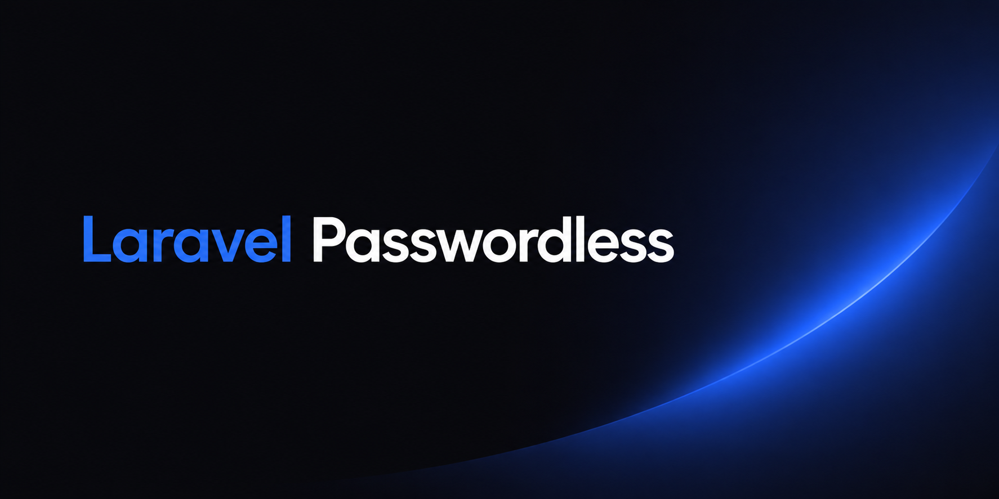

<p align="center">
    
</p>

# Introduction

Passwordless authentication for Laravel via email magic links. No passwords, no hassle. Users enter their email and receive a one-time login link.

## Installation

```bash
composer require harrisonclewis/laravel-passwordless
```

Run migrations:

```bash
php artisan migrate
```

Optional — publish the configurations

```bash
php artisan vendor:publish --tag=passwordless-config
php artisan vendor:publish --tag=passwordless-views
```

## Usage

**Sending the magic link**
```blade
<form method="POST" action="{{ route('passwordless.store') }}">
    @csrf
    <input type="email" name="email" placeholder="you@example.com" />
    <button type="submit">Send login link</button>
</form>

@if (session(config('passwordless.session.sent')))
    <p>Check your email for a login link.</p>
@endif
```

### Routes

The package registers two routes automatically:

| Method | URI | Description |
|--------|-----|-------------|
| `POST` | `/passwordless` | Accepts an email, creates and sends the magic link |
| `GET`  | `/passwordless/{token}` | Consumes the token and authenticates the user |

Point your login form at `route('passwordless.store')` and the rest is handled for you.

### Registration

By default, users who don't have an account are created automatically when they submit their email. Disable this if you want to restrict login to existing users only:

```php
// config/passwordless.php
'register' => false,
```

## Configuration

```php
// config/passwordless.php
return [
    'redirect'      => '/',           // Where to send the user after login
    'register'      => true,          // Auto-create users for unknown emails
    'token_lifetime' => 900,          // Link expiry in seconds (default: 15 min)
    
    ... others
];
```

## Requirements

- PHP ^8.1
- Laravel ^10.0|^11.0|^12.0|^13.0

## License

MIT
